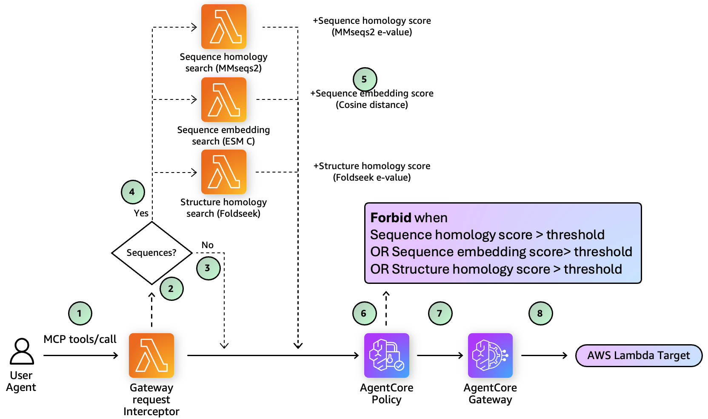
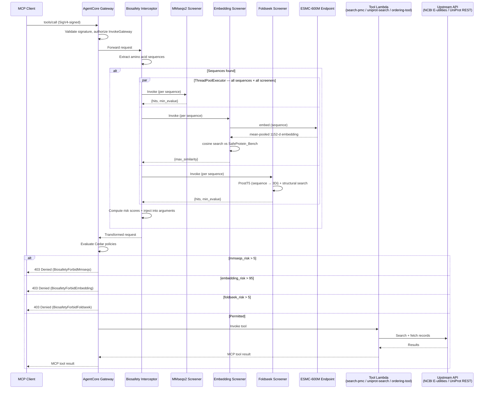
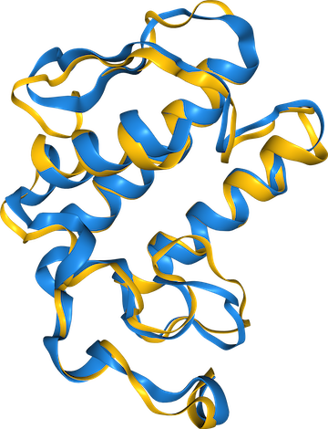

# Policy in Amazon Bedrock AgentCore for Biosafety Screening

Demonstration of how to use Policy in Amazon Bedrock AgentCore to deterministically screen AI agent tool requests for biosecurity risks.

## Background

AI agents in life-science workflows need different levels of access to different tools. **Policy in Amazon Bedrock AgentCore** provides a central, deterministic enforcement point: the gateway evaluates Cedar policies before a tool request can reach its target, enabling controls that are explicit, auditable, and independent of an agent's reasoning.

This project demonstrates three policy patterns for limiting tool use:

1. **Permit full access to PubMed Central search** for open scientific literature discovery.
2. **Filter UniProt searches by species** by denying requests whose `species` argument is on a configured blocklist.
3. **Screen sequences submitted to a third-party (3P) ordering tool** with defense in depth. A Gateway interceptor evaluates each sequence with MMseqs2 alignment, ESMC embedding similarity, and Foldseek structural homology; Cedar policies independently block requests that exceed any configured risk threshold.

Together, these examples show how AgentCore Policy can combine simple, deterministic input constraints with dynamic, domain-specific risk signals to govern AI-agent access to scientific tools.

## Quick Start

```bash
make sync
make prepare-foldseek-structures   # populate the Foldseek Docker build context

uv run cdk bootstrap   # first time only, per account/region
make deploy-all

uv run scripts/invoke_gateway.py
```

Requires [uv](https://docs.astral.sh/uv/), Python 3.12, Node.js + the AWS CDK CLI, Docker, and AWS
credentials. See [Prerequisites](#prerequisites) and [Deploy](#deploy) for details,
[Testing](#testing) for running the unit and infrastructure test suites, and
[Authentication](#authentication) for connecting an MCP client instead of the smoke-test script.

A `Makefile` wraps the common `uv`/`cdk`/`pytest` commands — run `make help` for the full list.

## Architecture





**Two CDK stacks:**

| Stack                  | Purpose                                                                                                                            |
|------------------------|------------------------------------------------------------------------------------------------------------------------------------|
| `BiosafetyStack`       | ESMC-600M + Foldseek SageMaker endpoints, MMseqs2 Docker Lambda, embedding-screening Lambda, biosafety interceptor Lambda          |
| `ResearchGatewayStack` | AgentCore Gateway (+ trace and application-log delivery), Cedar policy engine, PMC search + UniProt search + ordering tool Lambdas |

## Prerequisites

- [uv](https://docs.astral.sh/uv/) (`brew install uv`)
- Python 3.12
- Node.js + AWS CDK CLI (`npm install -g aws-cdk`)
- Docker (for Lambda layer bundling and container image builds)
- AWS credentials configured

The threat PDB structures are fetched from RCSB at build time (step 1 below) — no S3 bucket is
needed to deploy. `scripts/download_pdb.py` is an optional archival step and is the only thing that
requires one.

## Deploy

### 1. Prepare the Foldseek structure database

The Foldseek search database is built into the container image at Docker build time. Populate the build context first:

```bash
make sync
uv run python scripts/prepare_foldseek_structures.py
```

This downloads PDB files directly from RCSB into `deploy/containers/foldseek/structures/`. The `structures/` directory is gitignored — it must be populated before each `cdk deploy` that rebuilds the Foldseek image.

To archive the PDB files to S3 for safekeeping (optional):

```bash
uv run python scripts/download_pdb.py --bucket <your-bucket>
```

### 2. Deploy the CDK stacks

```bash
uv run cdk bootstrap   # first time only, per account/region
make deploy-all         # cdk deploy --all
```

Stack outputs:

- `GatewayUrl` — MCP endpoint for connecting clients
- `GatewayId` — AgentCore Gateway ID
- `GatewayArn` — Gateway ARN, for the `Resource` in a caller's invoke policy
- `PolicyEngineId` — Cedar policy engine ID
- `EsmcEndpointName` — ESMC-600M SageMaker endpoint name
- `EsmcEndpointUrl` — ESMC-600M SageMaker endpoint invocation URL
- `FoldseekEndpointName` — Foldseek+ProstT5 SageMaker endpoint name

## Testing

Tests live under `tests/`, mirroring `src/research_gateway/`:

- `tests/unit` — Lambda handler logic (PMC search, UniProt search, ordering tool, biosafety interceptor).
- `tests/infrastructure` — CDK stack assertions. These synthesize with the `aws:cdk:bundling-stacks: []` context key, which skips real asset bundling, so this suite doesn't need Docker even though `BiosafetyStack` contains `DockerImageAsset`/`DockerImageFunction` constructs.
- `tests/integration` — opt-in checks against a deployed gateway. They load `GatewayClient` from `scripts/invoke_gateway.py`, so the tests use the same SigV4 signing, MCP `initialize`/`notifications/initialized` sequence, session handling, and tool-call transport as the smoke-test script.

```bash
make test           # hermetic unit + infrastructure suite (deployed checks are skipped)
make test-unit       # tests/unit only
make test-infra      # tests/infrastructure only

make test-gateway-integration  # deployed MCP list, PMC, and Cedar-policy checks
make test-gateway-full         # baseline checks plus ordering-tool biosafety checks
```

`test-gateway-integration` verifies MCP initialization, lists the three deployed tools, invokes a permitted PMC search, and verifies the blocked UniProt-species policy. It uses a deployed `ResearchGatewayStack` and ambient AWS credentials. With the default stack-output lookup, those credentials need both `cloudformation:DescribeStacks` on `ResearchGatewayStack` and `bedrock-agentcore:InvokeGateway` on its `GatewayArn`. Supplying `--gateway-url` avoids the CloudFormation read, but never avoids the invoke permission.

The defaults are `ResearchGatewayStack` and `us-east-1`. To target another deployment, pass pytest options directly:

```bash
uv run pytest --run-gateway-integration tests/integration \
  --gateway-url "$GATEWAY_URL" --gateway-region us-west-2
# or: --gateway-stack MyResearchGatewayStack --gateway-region us-west-2
```

`test-gateway-full` includes the baseline checks and sends the documented allow and deny ordering sequences through MMseqs2, ESMC, and Foldseek. It requires the screening resources from `BiosafetyStack`, invokes the ESMC GPU-backed endpoint (Foldseek's endpoint is CPU-only), and is deliberately separate because of its latency and AWS cost. The ordering target is a mock: no real order is placed.

The unit and infrastructure suites do not build or run the ML inference containers (`deploy/containers/esmc/`, `deploy/containers/foldseek/`, `deploy/containers/mmseqs2/`, `src/research_gateway/screening/embedding/`). `test-gateway-full` reaches deployed screeners through the gateway but is not a replacement for container build/runtime validation; see [Test the ESMC container locally](#test-the-esmc-container-locally) and [Implementation and component testing](#implementation-and-component-testing) for that path.

## Tracing and logging

Gateway **tracing** is wired up by `ResearchGatewayStack`. AgentCore does not configure a span
destination for gateways on its own, so the stack creates the vended-log delivery that the
**Tracing** toggle in the AgentCore console would otherwise create:

```text
CfnDeliverySource (logType TRACES, resourceArn = GatewayArn)
  → CfnDeliveryDestination (deliveryDestinationType XRAY)
    → CfnDelivery
```

Spans land in the account-wide `aws/spans` log group and surface on the
[CloudWatch GenAI Observability page](https://docs.aws.amazon.com/bedrock-agentcore/latest/devguide/observability-gateway-metrics.html),
carrying `trace_id`, `span_id`, and the tool name per request.

**Prerequisite:** CloudWatch Transaction Search must be enabled account-wide, or AgentCore has
nowhere to put the spans. This is a one-time, account-level setting shared with every other
AgentCore resource in the account, so the stack deliberately does not manage it:

```bash
aws xray get-trace-segment-destination            # expect Destination=CloudWatchLogs, Status=ACTIVE
aws xray update-trace-segment-destination --destination CloudWatchLogs   # if it is not
```

Gateway **application logs** are wired up by the same stack, using the same three-resource pattern
with `logType=APPLICATION_LOGS` and a `CWL` destination:

```text
LogGroup /aws/vendedlogs/bedrock-agentcore/gateway/APPLICATION_LOGS/<gateway-name>
CfnDeliverySource (logType APPLICATION_LOGS, resourceArn = GatewayArn)
  → CfnDeliveryDestination (deliveryDestinationType CWL, destinationResourceArn = log group)
    → CfnDelivery
```

These are the per-request narrative rather than timing: request processing start and completion,
target configuration errors, requests rejected for missing or malformed authorization headers,
requests naming an unknown tool or method — **including the request and response bodies** for every
MCP operation. They share `trace_id` and `span_id` with the spans above, so you can pivot between
the two.

Two consequences worth knowing:

- **Request bodies contain the screened amino acid sequences, and response bodies contain full PMC
  article abstracts.** That is the audit trail for what was screened and what came back, but it
  also means sequence data comes to rest in CloudWatch Logs. Retention is `LOG_RETENTION` in
  `src/research_gateway/infrastructure/gateway_stack.py` — 7 days, shared with the Lambda log groups.
- CloudWatch Logs ingestion is billed per GB, and article abstracts are not small.

The log group path is keyed on the gateway *name*, not the gateway *id* that the AgentCore console
would use, so replacing the gateway keeps appending to one log group rather than orphaning the old
one and splitting the trail.

CloudWatch Logs attaches the `delivery.logs.amazonaws.com` resource policy to the log group itself
when the delivery is created, so nothing needs to grant that explicitly. To confirm after a deploy:

```bash
aws logs describe-resource-policies --policy-scope RESOURCE \
  --resource-arn "$(aws logs describe-log-groups \
    --log-group-name-prefix /aws/vendedlogs/bedrock-agentcore/gateway \
    --query 'logGroups[0].logGroupArn' --output text)"
```

## Authentication

The gateway uses **IAM (SigV4) inbound auth**. There are no bearer tokens, no user pool, and
nothing to refresh — callers sign requests with ordinary AWS credentials from the standard
credential chain (environment, `AWS_PROFILE`, instance/task role).

Callers need `bedrock-agentcore:InvokeGateway` on the gateway:

```json
{
  "Version": "2012-10-17",
  "Statement": [
    {
      "Effect": "Allow",
      "Action": "bedrock-agentcore:InvokeGateway",
      "Resource": "<GatewayArn stack output>"
    }
  ]
}
```

MCP clients cannot SigV4-sign requests themselves. Use
[`mcp-proxy-for-aws`](https://pypi.org/project/mcp-proxy-for-aws/), which runs a local stdio
MCP server that signs and forwards to the gateway:

```json
{
  "mcpServers": {
    "research-gateway": {
      "command": "uvx",
      "transport": "stdio",
      "args": [
        "mcp-proxy-for-aws@latest",
        "<GatewayUrl stack output>",
        "--service", "bedrock-agentcore",
        "--region", "us-east-1"
      ],
      "env": { "AWS_PROFILE": "<profile>" }
    }
  }
}
```

`--service bedrock-agentcore` is required — the proxy does not infer the signing service from
the URL.

## Invoke the PMC Search Tool

**Direct Lambda invocation:**

```bash
aws lambda invoke \
  --function-name search-pmc \
  --cli-binary-format raw-in-base64-out \
  --payload '{"query": "CRISPR gene editing", "rerank_by": "references"}' \
  response.json && cat response.json | jq
```

**Via the gateway (SigV4 smoke test):**

```bash
uv run scripts/invoke_gateway.py --list-tools
uv run scripts/invoke_gateway.py --tool pmc-search___search_pmc --args '{"query": "CRISPR gene editing"}'
```

Reads `GatewayUrl` from the stack outputs and signs with your ambient AWS credentials. Useful for
confirming auth, Cedar policies, and biosafety screening from the CLI without an MCP client.

**Via MCP Inspector:**

Inspector cannot sign SigV4, so point it at the `mcp-proxy-for-aws` stdio proxy rather than at
the gateway URL:

```bash
npx @modelcontextprotocol/inspector \
  uvx mcp-proxy-for-aws@latest "$GATEWAY_URL" --service bedrock-agentcore --region us-east-1
```

- Transport: `STDIO`
- Credentials come from the environment Inspector inherits (see [Authentication](#authentication))

## Implementation and component testing

The CDK app deploys the following resources. Run all `cdk` commands from the repository root.

### `BiosafetyStack`

- **`esmc-600m`** — SageMaker real-time endpoint with a GPU BYOC container (`ml.g5.xlarge` by default). It bakes the open-source [`biohub/ESMC-600M`](https://huggingface.co/biohub/ESMC-600M) weights into the image, runs under network isolation, and accepts `{"sequence": "..."}` to return a mean-pooled 1,152-dimensional embedding.
- **`mmseqs-screening`** — 3 GB x86_64 Docker Lambda that searches the bundled `SafeProtein_Bench.fasta` database and returns `{hits, count, min_evalue}`.
- **`embedding-screening`** — 512 MB, 30-second Python 3.12 Lambda that calls the ESMC endpoint and searches the normalized 429-protein reference index. It returns `{hits, count, max_similarity}`.
- **`foldseek-prostt5`** — SageMaker real-time CPU endpoint (`ml.c6i.2xlarge` by default) containing the Foldseek CPU/AVX2 binary, ProstT5 weights, and a pre-built database of 429 threat structures. It accepts a sequence and returns `{hits, count, min_evalue}`.
- **`biosafety-interceptor`** — 256 MB, 60-second Python 3.12 Lambda that screens every gateway tool request in parallel and injects flat risk-score scalars. A screen failure blocks the request.

The stack exposes the interceptor and all three thresholds to `ResearchGatewayStack`.

### `ResearchGatewayStack`

- **`search-pmc`** and **`uniprot-search`** — 512 MB, 60-second Python 3.12 Lambdas; the former queries NCBI E-utilities and the latter searches then fetches UniProt details concurrently.
- **`ordering-tool`** — 128 MB, 30-second mock protein-synthesis Lambda.
- **`SearchPmcDependenciesLayer`** — the shared `PythonLayerVersion` built from `deploy/layers/search/requirements.txt`.
- **`search_pmc_policy_engine`** — an `ENFORCE` Cedar policy engine with the following policies:

  | Policy | Effect | Condition |
  | --- | --- | --- |
  | `AllowAll` | permit | All principals and actions on this gateway |
  | `AllowUniProtSearch` | permit | Currently identical to `AllowAll`; retained as a named hook for narrowing access when the blanket permit is removed |
  | `ForbidBlockedUniProtSpecies` | forbid | `search_uniprot`'s `species` argument matches an entry in `BLOCKED_UNIPROT_SPECIES` |
  | `BiosafetyForbidMmseqs` | forbid | `_biosafety_mmseqs_risk_score` exceeds its threshold |
  | `BiosafetyForbidEmbedding` | forbid | `_biosafety_embedding_risk_score` exceeds its threshold |
  | `BiosafetyForbidFoldseek` | forbid | `_biosafety_foldseek_risk_score` exceeds its threshold |

  This construct version cannot scope Cedar policies to an individual SigV4 caller or tool. Its documented non-wildcard principal type is `AgentCore::OAuthUser`, which requires token-derived tags, while this gateway uses SigV4. The named `AllowUniProtSearch` policy therefore does not narrow access by itself — species filtering is enforced separately, by `ForbidBlockedUniProtSpecies`, which needs no principal scoping because it conditions on `context.input.species` (the gateway flattens the tool's input schema properties onto `context.input`) rather than on who is calling.
- **`research-gateway-<hash>`** — the IAM-authenticated AgentCore Gateway with all three Lambda targets, the policy engine, request interceptor, tracing, and application-log delivery. The suffix is derived from `Stack.node.addr[:8]`, so its name is stable across redeployments.

All tool Lambdas return an MCP response envelope rather than a raw object:

```json
{
  "content": [{"type": "text", "text": "Human-readable summary"}],
  "structuredContent": {"status": "success", "...": "tool result"},
  "isError": false
}
```

Errors put `{ "status": "error", "message": "..." }` in `structuredContent` and set `isError` to `true`.

### Invoke components directly

The PMC command above invokes `search-pmc` directly. To invoke UniProt directly:

```bash
aws lambda invoke \
  --function-name uniprot-search \
  --region us-east-1 \
  --cli-binary-format raw-in-base64-out \
  --payload '{"query": "SARS-CoV-2 spike protein"}' \
  response.json && cat response.json | jq
```

For a direct embedding-screening smoke test:

```bash
aws lambda invoke \
  --function-name embedding-screening \
  --region us-east-1 \
  --cli-binary-format raw-in-base64-out \
  --payload '{"sequence": "FVNQHLCGSHLVEALYLVCGERGFFYTPKT"}' \
  response.json && cat response.json | jq
```

### Test the ESMC container locally

The image builds and self-tests on CPU, but GPU inference uses the bf16 autocast path. On a GPU-enabled Docker host:

```bash
cd deploy/containers/esmc
docker build --platform linux/amd64 -t esmc-byoc .    # roughly 8 GB; verifies model weights load
docker run --rm --gpus all -p 8080:8080 esmc-byoc     # logs should report loading onto CUDA

curl -sf localhost:8080/ping
curl -s -X POST localhost:8080/invocations -H 'Content-Type: application/json' \
  -d '{"sequence": "FVNQHLCGSHLVEALYLVCGERGFFYTPKT"}' | jq '.embedding | length'
```

`/ping` returns 200 only after the model has loaded, and the invocation should return an embedding
of length `1152`. The build validates model-load reporting (`missing_keys` and `mismatched_keys`),
not merely the output shape, preventing an incompatible checkpoint from silently yielding a
randomly initialized encoder.

## Tool Reference

### `search_pmc`

Search PubMed Central.

| Parameter   | Type   | Required | Description                                                     |
| ----------- | ------ | -------- | --------------------------------------------------------------- |
| `query`     | string | Yes      | PMC search query (field tags, booleans, date filters)           |
| `rerank_by` | string | No       | `"references"` to rank by intra-result-set citation count       |

Returns: `{status, query, total_found, returned, ranked_by, articles[]}` where each article includes `pmc_id`, `pmid`, `doi`, `url`, `title`, `authors`, `journal`, `year`, `abstract`, `reference_count`, `referenced_by_count`.

### `search_uniprot`

Search UniProtKB and return full protein records. One tool call does both API hops: the query is
resolved against the UniProt search API, then the detail record for each hit is fetched concurrently.

| Parameter | Type   | Required | Description                                                                                                            |
| --------- | ------ | -------- | ---------------------------------------------------------------------------------------------------------------------- |
| `query`   | string | Yes      | Protein query, e.g. `"Human insulin"` or `"SARS-CoV-2 spike protein"`                                                  |
| `species` | string | No       | Organism filter — the full scientific name UniProt recognizes, e.g. `"Homo sapiens"`, not a common name like `"human"` |

Plain text is expanded across the protein name, gene, function, disease, and keyword fields, plus a
full-text clause requiring every term. `species`, when given, is ANDed onto that expansion verbatim as
an `organism_name` filter — there is no common-name mapping, so a vague or non-scientific value like
`"human"` or `"coronavirus"` is passed straight to UniProt and may match loosely or across multiple
species rather than being rejected.

A query that already contains UniProt field syntax is passed through verbatim instead of being
expanded — that is how you reach filters beyond organism, e.g. review status:

```text
insulin AND organism_name:"Mus musculus"
spike AND reviewed:true
gene:INS
```

Don't combine `species` with a query that already has its own `organism_name` filter — the two are
ANDed together and can conflict.

Returns: `{status, query, uniprot_query, total_found, returned, proteins[]}` where each protein
includes `accession`, `entry_name`, `protein_name`, `gene_names`, `organism`, `length`, `reviewed`,
`url`, `function`, `subcellular_locations`, `diseases`, `features`, `pdb_ids`, and `sequence`.
`uniprot_query` echoes back what was actually sent to UniProt, so you can see how a plain-text query
was expanded.

Result count is fixed at 10 (`DEFAULT_LIMIT` in `src/research_gateway/tools/uniprot/search.py`). An accession whose detail fetch
fails is logged and dropped rather than failing the whole call, so `returned` can be lower than the
number of search hits.

**`total_found` is not a relevance count.** It is how many UniProtKB entries match the *expanded*
query, and the expansion is deliberately broad — `"SARS-CoV-2 spike protein"` expands to include
`keyword:"protein"`, which matches ~92M entries. Relevance ranking still puts the right answer first
(that query returns `P0DTC2 SPIKE_SARS2`), but the count itself is an artifact. It is only a precise
match count when the caller supplied explicit UniProt field syntax. The text summary omits it for
this reason; only `structuredContent` carries it.

`features` only covers domains and regions (`ft_domain`, `ft_region` in `DETAIL_FIELDS`), so entries
annotated solely with signal peptides or disulfide bonds — insulin among them — return `features: []`.
Widen `DETAIL_FIELDS` if you need more.

### `ordering_tool`

Mock protein synthesis ordering tool — a placeholder target, useful mainly for exercising biosafety
screening on a tool whose arguments are sequences rather than free text.

| Parameter | Type     | Required | Description                                  |
|-----------|----------|----------|----------------------------------------------|
| `inputs`  | string[] | Yes      | Amino acid sequences to submit for synthesis |

Returns an order ID.

## Biosafety Screening

Every `tools/call` request passes through the biosafety interceptor before reaching any tool, but the
interceptor only runs its screening logic for calls to the `ordering-tool` target — AgentCore Gateway
interceptors cannot be scoped to a target at the infrastructure level (they are configured once, gateway-wide,
with at most one `REQUEST` and one `RESPONSE` interceptor), so the scoping happens inside the interceptor
Lambda itself, by checking the `<target>___<tool>`-prefixed `params.name` on the incoming request. Calls to
`search-pmc` and `uniprot-search` pass through unmodified without extracting sequences or invoking any
screener.

Screening is **request-side only** — the interceptor is registered with
`LambdaInterceptor.for_request(...)`, so it inspects tool arguments, not tool responses. Two consequences
worth knowing:

- `search_uniprot` returns amino acid sequences that are **not** screened on the way out, and they would
  **not** be screened on the way in either if an agent passed them to `search_pmc` or `search_uniprot` —
  only a subsequent call to `ordering_tool` would trigger screening.
- A free-text query to `search_pmc` or `search_uniprot` that happens to contain a ≥20-residue run of amino
  acid letters is *not* screened, since screening never runs for those targets.

### MMseqs2 Sequence Alignment

Screens each sequence against the SafeProtein_Bench threat database using MMseqs2 local alignment.

- **Score:** `mmseqs_risk_score = -log10(min_evalue)`, clamped to 999
- **Blocked if:** `mmseqs_risk_score > 5` (equivalent to E-value < 1e-5)
- **Injected attribute:** `_biosafety_mmseqs_risk_score`

E-value to risk score reference:

| E-value | Risk score | Interpretation |
| --------- | ------------ | ---------------- |
| 1.0 | 0 | No significant match |
| 1e-1 | 1 | Weak |
| 1e-5 | 5 | Threshold — blocked above this |
| 1e-10 | 10 | Moderate homology |
| 1e-52 | 52 | Strong homology |
| ≤1e-999 | 999 | Maximum (capped) |

### ESMC-600M Embedding Similarity

Embeds each sequence using the [ESMC-600M](https://www.evolutionaryscale.ai/papers/esmc-600m) protein language model — the open-source [`biohub/ESMC-600M`](https://huggingface.co/biohub/ESMC-600M) weights served from a self-built SageMaker endpoint (`deploy/containers/esmc/`) — then computes cosine similarity against a pre-computed index of 429 SafeProtein_Bench reference sequences.

The container returns a mean-pooled 1152-d vector directly, so the reference index **must be regenerated with `scripts/embed_fasta.py` against the same endpoint that serves queries**. Index and query vectors have to come from an identical code path, or the cosine scores — and the threshold calibrated against them — are not comparable.

- **Score:** `embedding_risk_score = int(max_cosine_similarity × 100)`, range 0–100
- **Blocked if:** `embedding_risk_score > 95` (cosine similarity > 0.95)
- **Injected attributes:** `_biosafety_embedding_risk_score`, `_biosafety_embedding_max_similarity`

Cosine similarity in protein embedding space is dense — even structurally unrelated proteins typically score 0.85–0.90 against a large reference set. The threshold of 95 is calibrated so that only near-identical sequences (e.g. the exact reference sequence scores 1.00) are blocked, while dissimilar sequences (e.g. human insulin B chain scores ~0.88) pass freely.

### Foldseek Structural Homology

Screens each sequence for structural similarity to known threat proteins using [Foldseek](https://github.com/steineggerlab/foldseek). The sequence is translated to the 3Di structural alphabet using the [ProstT5](https://huggingface.co/Rostlab/ProstT5) language model, running inside a CPU-only SageMaker endpoint (`ml.c6i.2xlarge`), then searched against a database of 429 threat protein structures built from PDB files.

- **Score:** `foldseek_risk_score = -log10(min_evalue)`, clamped to 999 (same scale as MMseqs2)
- **Blocked if:** `foldseek_risk_score > 5` (equivalent to E-value < 1e-5)
- **Injected attribute:** `_biosafety_foldseek_risk_score`

Detects threats that evade sequence-based methods — proteins with unrelated sequences but the same fold. Runs in parallel with MMseqs2 and embedding screening. Typical latency: ~1–3s (ProstT5 inference dominates).

**Defense-in-depth example:** 3G8H chain A, a horned-viper neurotoxin in SafeProtein_Bench, shares a similar fold with 4NTW chain C from the Texas coral snake despite their very different sequences. A 4NTW chain C query falls below the configured MMseqs2 and embedding deny thresholds, but Foldseek detects its structural relationship to the 3G8H chain A target and blocks it. This is why structural screening is an independent, required layer rather than a substitute for sequence or embedding screening.



*Structural superposition of the horned-viper 3G8H chain A target and the Texas coral-snake 4NTW chain C query.*

The [sequence-alignment artifact](img/Alignment.txt) reports 32/102 identities (31%), 41% positives, 6% gaps, and an E-value of `3e-13`:

<details>
<summary>Sequence alignment: 3G8H chain A and 4NTW chain C</summary>

```text
Query  1    SLLEFGMMILGETGKNPLTSYSFYGCYCGVGGKGTPKDATDRCCFVHDCCYGN---LPDC  57
            +L +F +MI   T       +  YGCYC      TP D  DRCC     CY     +  C
Sbjct  1    NLNQFRLMIKC-TNDRVWADFVDYGCYCVARDSNTPVDDLDRCCQAQKQCYDEAVKVHGC  59

Query  58   SPKTDRYKY---HRENGAIVCGKGTSCENRICECDRAAAICF  96
             P    Y +   +  +     G  T C N +C CDR A +C
Sbjct  60   KPLVMFYSFECRYLASDLDCSGNNTKCRNFVCNCDRTATLCI  101
```

</details>

The Foldseek endpoint is optional at runtime. If `FOLDSEEK_ENDPOINT_NAME` is unset (e.g. `BiosafetyStack` not yet deployed), the interceptor skips structural screening silently.

### Combined Result

Any screen can independently block a request (fail-closed). The interceptor also injects `_biosafety_sequences_found` and `_biosafety_screened_at` for audit purposes.

### Thresholds

All thresholds can be overridden at deploy time:

```bash
uv run cdk deploy ResearchGatewayStack \
  --context mmseqs_risk_threshold=8 \
  --context embedding_risk_threshold=97 \
  --context foldseek_risk_threshold=8
```

## Configuration

| Variable | Where | Purpose |
| ---------- | ------- | --------- |
| `NCBI_API_KEY` | Lambda env var | Raises NCBI rate limit from 3 → 10 req/sec |
| `COMMERCIAL_USE_ONLY` | Lambda env var | Restricts results to CC-licensed articles (default: `True`) |
| `mmseqs_risk_threshold` | CDK context | MMseqs2 risk score above which requests are blocked (default: `5`) |
| `embedding_risk_threshold` | CDK context | Embedding risk score above which requests are blocked (default: `95`) |
| `foldseek_risk_threshold` | CDK context | Foldseek structural risk score above which requests are blocked (default: `5`) |
| `esmc_instance_type` | CDK context | SageMaker instance type for the ESMC-600M endpoint (default: `ml.g5.xlarge`) |
| `esmc_instance_count` | CDK context | ESMC-600M endpoint instance count (default: `1`) |
| `foldseek_instance_type` | CDK context | SageMaker instance type for the Foldseek endpoint (default: `ml.c6i.2xlarge`) |
| `foldseek_instance_count` | CDK context | Foldseek endpoint instance count (default: `1`) |

## Project Structure

```bash
├── app.py                       # Thin CDK entrypoint — calls synth_app()
├── cdk.json                     # CDK config
├── pyproject.toml               # Project metadata, dependencies, pytest config
├── uv.lock
├── scripts/
│   ├── invoke_gateway.py        # SigV4-signed MCP smoke test against the gateway
│   ├── prepare_foldseek_structures.py  # Download threat PDBs into the Docker build context
│   ├── download_pdb.py          # Archive threat PDBs to S3
│   └── embed_fasta.py           # Regenerate the embedding reference index
├── references/                  # Background reading
├── schemas/
│   └── tools/                   # MCP tool schemas, versioned with the code
│       ├── search_pmc.json
│       ├── search_uniprot.json
│       └── ordering.json
├── deploy/                       # Deployment-only assets — not importable Python
│   ├── containers/               # Self-contained Docker build contexts
│   │   ├── mmseqs2/              # MMseqs2 screening Lambda (Docker)
│   │   │   ├── Dockerfile
│   │   │   ├── handler.py
│   │   │   └── SafeProtein_Bench.fasta
│   │   ├── esmc/                 # ESMC-600M SageMaker BYOC container
│   │   │   ├── Dockerfile        # torch cu124, pinned Biohub transformers fork, baked HF weights
│   │   │   ├── inference.py      # tokenize → forward (bf16 autocast) → strip BOS/EOS → mean-pool
│   │   │   ├── app.py            # Flask /ping (model-aware) + /invocations
│   │   │   └── serve             # Gunicorn entrypoint (gthread, --timeout 0)
│   │   └── foldseek/             # Foldseek+ProstT5 SageMaker BYOC container
│   │       ├── Dockerfile        # python:3.12-slim base, CPU/AVX2 Foldseek binary, ProstT5 weights, pre-built threat DB
│   │       ├── inference.py      # search logic: createdb --prostt5-model → search → convertalis
│   │       ├── app.py            # Flask /ping + /invocations endpoints
│   │       ├── serve             # Gunicorn entrypoint
│   │       └── structures/       # PDB files (gitignored; populated by prepare_foldseek_structures.py)
│   └── layers/
│       ├── search/
│       │   └── requirements.txt  # Runtime deps: httpx, defusedxml, boto3
│       └── embedding/
│           └── requirements.txt  # numpy
├── src/research_gateway/         # Importable application package
│   ├── infrastructure/           # CDK stacks
│   │   ├── application.py        # build_app() / synth_app()
│   │   ├── biosafety_stack.py    # ESMC + Foldseek endpoints, MMseqs2 + embedding + interceptor Lambdas
│   │   ├── gateway_stack.py      # AgentCore Gateway, policy engine, tool Lambdas
│   │   └── paths.py              # Centralized filesystem locations
│   ├── tools/
│   │   ├── pmc/                  # search-pmc Lambda
│   │   │   ├── handler.py
│   │   │   └── search.py
│   │   ├── uniprot/              # uniprot-search Lambda
│   │   │   ├── handler.py
│   │   │   └── search.py
│   │   └── ordering/             # ordering-tool Lambda
│   │       └── handler.py
│   ├── biosafety/                # Biosafety interceptor Lambda
│   │   ├── interceptor.py
│   │   └── sequence_finder.py
│   └── screening/
│       └── embedding/            # ESMC embedding screening Lambda
│           ├── handler.py
│           └── data/
│               └── safeprotein_bench_index.npz
└── tests/
    ├── conftest.py
    ├── infrastructure/           # CDK stack + app-wiring tests
    └── unit/                     # Lambda handler + module tests, mirrors src/research_gateway/
        ├── tools/
        │   ├── pmc/
        │   ├── uniprot/
        │   └── ordering/
        └── biosafety/
```

## License

MIT-0
